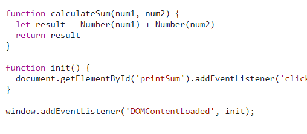

1. The problem was that the values intered in the input are of type string, so the sum was concatenating the strings together instead of adding them like numbers.
2. for the fix, I cast the strings to numbers in the calculateSum function. 